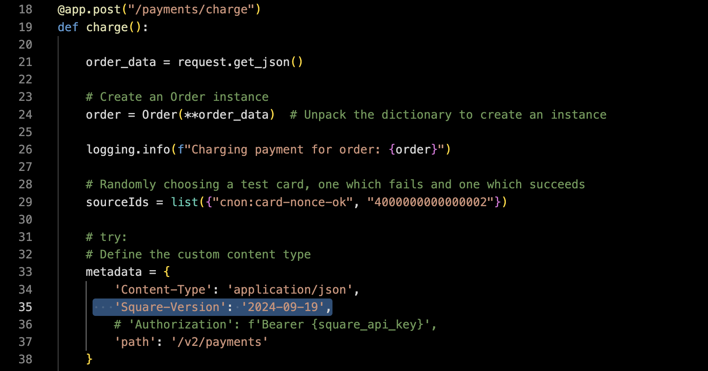

# Catalyst Order Processing Workflow

This solution demonstrates the capabilities provided by all five Catalyst APIs through a python-based order processing workflow. The end-to-end solution is comprised of five services:

- **order-processor**: Contains the order process workflow definition and all associated activity methods which will be executed as part of the workflow sequence using the Catalyst Workflow API.
- **inventory**: Receives direct invocation requests sent by the order-processor using the Invocation API to manage inventory state in the Diagrid KV Store through the Catalyst State API.
- **notifications**: Subscribes to messages published by the order-processor using the Pub/Sub API and subsequently displays those messages through a simple JavaScript user interface.
- **shipping**: Receives direct invocation requests sent by the order-processor using the Invocation API to simulate the scheduling of order shipments.
- **payments**: Receives direct invocation requests sent by the order-processor using the Invocation API to process order payments which are sent to the Square API using a Catalyst HTTP output binding.

For a live walkthrough: https://youtu.be/VAVQARDlHDo?t=1930

## App prerequisites

The solution is comprised of python services:

- Install [Python3](https://www.python.org/downloads/)

The payment app makes use of an HTTP output binding pointing to Square. Follow the steps below to configure:

### Setting up your HTTP binding component to connect to the Square Developer Sandbox APIs

1. Navigate to the [Square Developer](https://developer.squareup.com/us/en) website and click "Get started"
1. If you don't already have an account, select "Sign up". Otherwise, enter existing credentials.
1. Add a new application and call it `workflow-payment-app` or your own unique identifier.
1. Select "Skip" on the subsequent blades.
1. On the Credentials page, ensure `Sandbox` is selected in the top slider > find `Sandbox Access token` > Click "show" > Copy the Access Token value.
1. Navigate to the directory titled "catalyst-resources" and select the "square-http-binding.yaml" file. Replace `{your-square-api-token}` with the API token retrieved.
1. Return to the Square Developer portal and underneath the `Sandbox Access Token` section referenced above, copy the value for `Sandbox API version` and input the value for the HTTP header in the file `./services/payments/app.py` on line `35` as shown below: 
    

Once you have completed the above steps, you are ready to connect to the Square Payment API from your Dapr Workflow!

> NOTE: The application code calls out to the Square Payment API and will randomly select a failing test card or a successful test card to simulate various workflow paths.

## Build instructions

The build apps file will go through each application directory and run any app commands necessary to prepare the applications to run. Make sure it is executable using the below command:

```bash
chmod +X build-apps.sh
```

Run the script:

```bash
./build-apps.sh
```

## Connect local app using dev config file

Replace `unique-project-name` with a name for your workflow project

```bash
diagrid dev run --file dev-order-workflow.yaml --project <unique-project-name>
```

## Use the APIs

A `test.rest` file is available at the root of this repository and can be used with the VS Code `Rest Client` extension.
    
